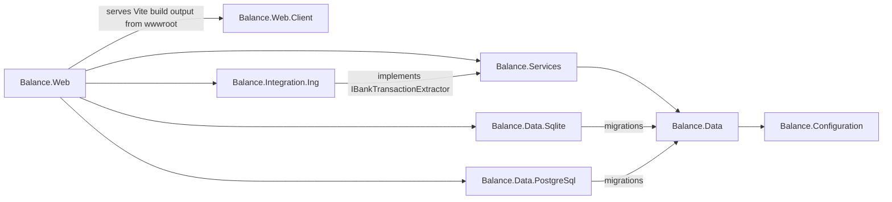

# CLAUDE.md

Guidance for Claude Code (and any other AI agent or human) working in this repository.

If you are adding documentation, prefer extending the files under `docs/` and updating the index below. Use [Mermaid](https://mermaid.js.org/) for any diagrams or charts — GitHub renders them natively. Do not draw diagrams as ASCII art.

## Quick links

- [Architecture](docs/architecture.md) — layers, project graph, DI composition, request/host startup
- [Project layout](docs/project-layout.md) — where things live and where new code should go
- [Conventions](docs/conventions.md) — coding patterns enforced by the codebase
- [Getting started](docs/getting-started.md) — local dev, build, test, run, configuration

## Commands

```bash
# Restore
# CLI tools (CSharpier)
dotnet tool restore
# NuGet packages      
dotnet restore
# Frontend npm packages (npm workspaces — single root node_modules covers Balance.Web.Client)
npm install

# Build (without restore) — server-only; the SPA builds separately via npm (ADR-0023)
dotnet build --no-restore -v:minimal

# Generate EF core migrations (without build)
# Add migration for PostgreSQL
dotnet ef migrations add <name> --no-build --project src/Balance.Data.PostgreSql/Balance.Data.PostgreSql.csproj --startup-project src/Balance.Web/Balance.Web.csproj -- --Database:Provider=Postgres
# Add migration for SQLite
dotnet ef migrations add <name> --no-build --project src/Balance.Data.Sqlite/Balance.Data.Sqlite.csproj --startup-project src/Balance.Web/Balance.Web.csproj -- --Database:Provider=Sqlite

# Format
# C# — CI check
dotnet csharpier check . --ignore-path .csharpierignore
# C# — auto-format
dotnet csharpier format . --ignore-path .csharpierignore
# Frontend (Prettier) — CI check
npm run format:check
# Frontend (Prettier) — auto-format
npm run format

# Test (without build)
# TUnit suite, runs with coverage in CI
dotnet test --no-build -v:minimal
# Single TUnit test
dotnet test --no-build -v:minimal --treenode-filter "/Balance.Tests/Balance.Tests.Domain/MoneyTests/Equality_uses_amount_and_currency"

# Run — two terminals during development
# .NET host (serves /api/*, and the last npm-built SPA at /)
dotnet run --project src/Balance.Web/Balance.Web.csproj
# Vite dev server (HMR; proxies /api → http://localhost:5248) — browse this URL
npm run dev

# Regenerate the typed API client after changing the backend API surface
# (dotnet build emits artifacts/openapi/Balance.Web.json; output is committed, CI checks drift).
# Automatic while `npm run dev` runs — a dev-only Vite plugin watches the document.
npm run codegen

# Publish — `npm run build` first: Vite outputs to src/Balance.Web/wwwroot and the
# static-web-assets pipeline packs it into the publish output (ADR-0023)
npm run build
dotnet publish src/Balance.Web/Balance.Web.csproj -c Release
```

The .NET host listens on `http://*:5248` (and `https://*:7189` via the `https` launch profile). The Vite dev server listens on `http://localhost:5173` by default and proxies `/api/*` to the .NET host. All backend routes are under `/api`: Scalar UI at `/api/docs/`, OpenAPI document at `/api/openapi/{document}.json`, liveness probe at `/api/healthz/live`, readiness probe at `/api/healthz/ready`. The React SPA owns everything else (served via `MapStaticAssets()` with `MapFallbackToFile("index.html")`).

## Architecture at a glance

Three-layer onion ASP.NET Core app targeting `net10.0`, with a React + Vite SPA shipped inside the same publish output. Solution is `Balance.slnx` (the new XML solution format).



**Layers**
- `Balance.Web` — Minimal APIs (all under `/api`), middleware pipeline, Scalar/OpenAPI, and the SPA host (`MapStaticAssets()` + `MapFallbackToFile("index.html")`). Uses `WebApplication.CreateSlimBuilder`.
- `Balance.Web.Client` — React 19 + TypeScript + Vite SPA. A plain npm workspace package (no .NET project). `npm run build` outputs straight into `src/Balance.Web/wwwroot/` (gitignored), where the standard static-web-assets pipeline discovers it on publish (ADR-0023). `dotnet build` never invokes npm.
- `Balance.Services` — Business logic, Quartz jobs, `IApplicationVersionService`, and the bank-import contract `IBankTransactionExtractor`. Composes `Configuration` + `Data` + `Jobs`.
- `Balance.Integration.Ing` — ING bank-statement importers. References `Balance.Services` and implements `IBankTransactionExtractor`; composed at the host *beside* Services (a third `AddBalanceIntegrationIng()` call), not nested under it, to avoid a Services↔Integration reference cycle. See `docs/adr/0018-integration-layer-composed-at-host.md`. New banks are new `Balance.Integration.<Bank>` projects.
- `Balance.Data` — EF Core `BalanceDbContext` (also implements `IDataProtectionKeyContext`), abstract `BaseEntity` (`Id`/`CreatedAt`/`UpdatedAt`), migration host extension, UTC value converters.
- `Balance.Data.Sqlite` / `Balance.Data.PostgreSql` — Provider-specific migrations assemblies (referenced by `Balance.Web`, not by `Balance.Data`).
- `Balance.Configuration` — Options pattern. `IOptionsSection` static-abstract contract, `DatabaseOptions` selecting `Sqlite` or `Postgres`, host environment helpers.
- `Balance.Tests` — TUnit suite. `InternalsVisibleTo` is set from `Balance.Web` and `Balance.Services`.

## Key conventions

These are conventions to follow when adding new code. See [docs/conventions.md](docs/conventions.md) for examples.

- **Use idiomatic C# with the latest language features.**
- **DI composition.** Each layer exposes a `public static class ServiceCollectionExtensions` with a single `AddBalance<Layer>(...)` extension. A layer composes its dependencies by calling the lower layer's `AddBalance*` inside its own. The web entry point calls `AddBalanceServices` + `AddBalanceIntegrationIng` + `AddBalanceWeb` — the integration layer is the documented exception that composes beside Services rather than nesting (ADR-0018); all other layers nest.
- **Options.** Strongly-typed options classes live under `Balance.Configuration/Options`, implement `IOptionsSection` (static-abstract `Section` name), and are wired through `AddSettings<T>` in `Balance.Configuration.ServiceCollectionExtensions`.
- **Database provider.** Selected at runtime via `Database:Provider` (`Sqlite` or `Postgres`). The provider switch lives in `Balance.Data/Helpers/DbContextOptionsBuilderExtensions.UseProvider`. Migrations live in the provider-specific assemblies; `BalanceDbContext` is provider-agnostic.
- **Entities.** Derive from `Balance.Data.Entities.BaseEntity` (`Id` `int`, `CreatedAt` `init`, `UpdatedAt`). All `DateTime` columns must round-trip as UTC via `DateConverters.UtcConverter`.
- **Constructors.** Do not use C# 12 primary constructors. Stick to the explicit pattern: `private readonly` fields plus a named constructor that assigns them.
- **Logging.** Use the source-generated `LoggerMessage` pattern. Each project has a `Logging/LoggerExtensions.cs` partial class; add `[LoggerMessage]` methods there rather than calling `ILogger.LogXxx` directly.
- **API surface.** All backend routes are mounted inside `var api = app.MapGroup("/api");` in `Program.cs`. Register feature endpoints through a `MapXxxEndpoints` extension and call it on `api`, not on `app` — the SPA fallback (`MapFallbackToFile("index.html")`) owns every non-`/api` URL.
- **Frontend.** The React SPA lives at `src/Balance.Web.Client`. Pages and components go under `src/`, public assets (favicon, etc.) under `public/`. The Vite dev server (`npm run dev`) proxies `/api` to the .NET host (`http://localhost:5248`) per `vite.config.ts`.
- **Background jobs.** Use the Quartz helpers in `Balance.Services/Jobs` (`ScheduleJobAt<TJob>(cron)`). The scheduler name is `"Balance Scheduler"`. Wire jobs inside `AddBalanceJobs`.
- **Visibility.** Default to `internal`; expose `public` only where another project legitimately needs the type. `Balance.Web` and `Balance.Services` use `InternalsVisibleTo` to share internals with `Balance.Tests`.
- **Language & spelling.** US English everywhere — identifiers, comments, UI copy, error codes, docs (`categorize`, `color`, `behavior`). Frontend copy goes through Lingui (no untranslated strings, lint-enforced — ADR-0022); use "journal entry", not "BT"/"JE", and avoid gratuitous em-dashes. **When you add or change a Lingui string, run `npm run extract` and supply the translation in every locale (`en`, `nl-NL`, `zh-TW`) in the same change — the `src/locales/` catalogs are drift-gated and must not contain empty `msgstr`s.** See [docs/conventions.md](docs/conventions.md#language-and-spelling).
- **Formatting.** CSharpier is the source of truth for C# and Prettier for the frontend — CI fails on any deviation. Always run `dotnet csharpier format .` (C#) and `npm run format` (frontend) before committing.
- **Commits.** Use [Conventional Commits](https://www.conventionalcommits.org/): `type(scope): summary` in the imperative mood. Types: `feat`, `fix`, `docs`, `chore`, `refactor`, `style`, `test`, `ci`, `build`, `perf`, `revert`. Scope (optional, lowercase) names the area (`reports`, `ing`, `client`/`spa`, `data`, `web`, `accounts`, `bank-accounts`, `bank-transactions`, `dashboard`, `sidebar`, `auth`, `settings`, …). Reference issues/PRs in a footer (`Refs: #NN`, `Closes #NN`), not the subject. Breaking changes use `type(scope)!:`. See [docs/conventions.md](docs/conventions.md#commit-messages).
- **Build hygiene.** `Directory.Build.props` enforces `TreatWarningsAsErrors=true`, nullable enabled, `AnalysisMode=All`, `LangVersion=latest`, and `UseArtifactsOutput=true`. Package versions are centralized in `Directory.Packages.props` — never pin a version inside a `.csproj`.

## Runtime composition

The web host startup follows this order:

1. `MapConfigurationSources` — patches JSON config providers to read from `AppContext.BaseDirectory` so the solution-root `appsettings.json` works when running from source.
2. `AddBalanceServices` → `AddBalanceConfiguration` → `AddBalanceData` (registers `BalanceDbContext`, factory, and Data Protection persistence) → `AddBalanceJobs` (Quartz hosted service) → `IApplicationVersionService`.
3. `AddBalanceWeb` — OpenAPI, lowercase routing, forwarded headers (trust any proxy IP, the app is assumed to sit behind a reverse proxy), cookie auth, antiforgery, permissive CORS, health checks.
4. `MigrateDatabaseAsync(cancellationToken)` runs `dbContext.Database.MigrateAsync` on startup, logged through `Balance.Data/Logging/LoggerExtensions`.
5. SPA hosting — `MapStaticAssets()` then `MapFallbackToFile("index.html")`. The SPA builds into `src/Balance.Web/wwwroot/` (Vite `outDir`), which the static-web-assets pipeline discovers and packs into the publish output (ADR-0023). Unmatched `/api/*` URLs hit an API-group fallback returning a Problem Details 404, never the SPA shell.
6. API endpoints — every backend route is registered on `var api = app.MapGroup("/api")`: `/api/healthz/{live,ready}`, `/api/openapi/...`, `/api/docs/` (Scalar), and the feature endpoint groups.
7. Middleware order (in `Program.cs`): `ExceptionHandler → StatusCodePages → ForwardedHeaders → DefaultFiles → Routing → CORS → Authentication → Authorization → Antiforgery`.

## CI

`.github/workflows/build-and-test.yml`: `dotnet tool restore` → `dotnet restore` → `npm ci` → CSharpier check → `dotnet build` (server-only, emits the OpenAPI document) → `npm run codegen` → frontend lint, format check, vitest → `npm run build` (into `wwwroot/`, regenerates `routeTree.gen.ts`) → `.gen.ts` drift gate (`git diff --exit-code -- '*.gen.ts'`) → CodeQL (public repos) → `dotnet test` with cobertura coverage. Test results and coverage are posted as sticky PR comments. A separate scheduled `codeql.yml` re-runs CodeQL weekly.

## Notes for AI agents

- **Always run CSharpier** (`dotnet csharpier format .`) after writing C# — CI fails otherwise and `TreatWarningsAsErrors=true` will catch a lot too.
- **Always run `npm run format`** (Prettier) after editing frontend code (`src/Balance.Web.Client`) — CI runs `format:check` (read-only) and fails on any deviation.
- **Match the existing DI pattern** when adding a new layer or feature module: a single `AddBalance*` extension that internally composes its dependencies.
- **Don't pin package versions in `.csproj`** — add or update the `PackageVersion` entry in `Directory.Packages.props`.
- **EF Core migrations** must be generated against the provider-specific assembly: The migrations assembly is wired up in `DbContextOptionsBuilderExtensions.UseProvider`.
- **Don't suppress warnings.** Don't use #pragma or SuppressMessageAttribute. Only use .editorconfig and only for global rules. Always try to fix the issue in code first.  
- **Make sure to create individual commits that make sense**.
- **Only build/test when neccesary**, these can be long running operations.
- Prefer running targeted tests instead of the full suite.
- Submit changes as a PR when done

## Agent skills

### Issue tracker

Issues live on GitHub at `balance-budget/balance-budget`, managed via the `gh` CLI. See `docs/agents/issue-tracker.md`.

### Triage labels

Default vocabulary: `needs-triage`, `needs-info`, `ready-for-agent`, `ready-for-human`, `wontfix`. See `docs/agents/triage-labels.md`.

### Domain docs

Single-context layout: `CONTEXT.md` and `docs/adr/` at the repo root. See `docs/agents/domain.md`.
