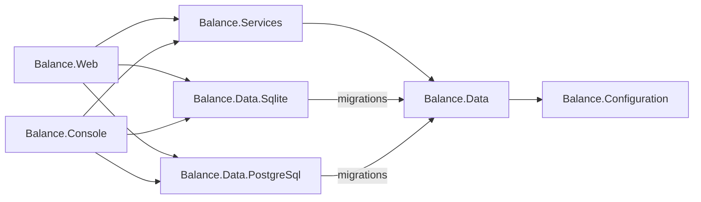

# CLAUDE.md

Guidance for Claude Code (and any other AI agent or human) working in this repository.

If you are adding documentation, prefer extending the files under `docs/` and updating the index below. Use [Mermaid](https://mermaid.js.org/) for any diagrams or charts — GitHub renders them natively. Do not draw diagrams as ASCII art.

## Quick links

- [Architecture](docs/architecture.md) — layers, project graph, DI composition, request/host startup
- [Project layout](docs/project-layout.md) — where things live and where new code should go
- [Conventions](docs/conventions.md) — coding patterns enforced by the codebase
- [Getting started](docs/getting-started.md) — local dev, build, test, run, configuration

## Commands

```bash
# Restore
# CLI tools (CSharpier)
dotnet tool restore
# NuGet packages      
dotnet restore

# Build (without restore)
dotnet build --no-restore -v:minimal

# Generate EF core migrations (without build)
# Add migration for PostgreSQL
dotnet ef migrations add <name> --no-build --project src/Balance.Data.PostgreSql/Balance.Data.PostgreSql.csproj --startup-project src/Balance.Web/Balance.Web.csproj -- --Database:Provider=Postgres
# Add migration for SQLite
dotnet ef migrations add <name> --no-build --project src/Balance.Data.Sqlite/Balance.Data.Sqlite.csproj --startup-project src/Balance.Web/Balance.Web.csproj -- --Database:Provider=Sqlite

# Format
# CI check
dotnet csharpier check . --ignore-path .csharpierignore
# Auto-format
dotnet csharpier format . --ignore-path .csharpierignore

# Test (without build)
# TUnit suite, runs with coverage in CI
dotnet test --no-build -v:minimal
# Single TUnit test
dotnet test --no-build -v:minimal --treenode-filter "/Balance.Tests/Balance.Tests.Domain/MoneyTests/Equality_uses_amount_and_currency"

# Run
dotnet run --project src/Balance.Web/Balance.Web.csproj
```

The web app listens on `http://*:5248` (and `https://*:7189` via the `https` launch profile). Scalar UI is mounted at `/scalar/`, HTMX fragments at `/htmx/*`, liveness probe at `/healthz/live` and readiness probe at `/healthz/ready`.

## Architecture at a glance

Clean Architecture ASP.NET Core app targeting `net10.0`. Solution is `Balance.slnx` (the new XML solution format).



**Layers**
- `Balance.Web` — Minimal APIs, HTMX endpoints, middleware pipeline, Scalar/OpenAPI. Uses `WebApplication.CreateSlimBuilder`.
- `Balance.Console` — Standalone `Host.CreateApplicationBuilder` entry point that shares the service graph (currently bootstraps Quartz).
- `Balance.Services` — Business logic, Quartz jobs, `IApplicationVersionService`. Composes `Configuration` + `Data` + `Jobs`.
- `Balance.Data` — EF Core `BalanceDbContext` (also implements `IDataProtectionKeyContext`), abstract `BaseEntity` (`Id`/`CreatedAt`/`UpdatedAt`), migration host extension, UTC value converters.
- `Balance.Data.Sqlite` / `Balance.Data.PostgreSql` — Provider-specific migrations assemblies (referenced by `Balance.Web`/`Balance.Console`, not by `Balance.Data`).
- `Balance.Configuration` — Options pattern. `IOptionsSection` static-abstract contract, `DatabaseOptions` selecting `Sqlite` or `Postgres`, host environment helpers.
- `Balance.Tests` — TUnit suite. `InternalsVisibleTo` is set from `Balance.Web` and `Balance.Services`.

## Key conventions

These are conventions to follow when adding new code. See [docs/conventions.md](docs/conventions.md) for examples.

- **DI composition.** Each layer exposes a `public static class ServiceCollectionExtensions` with a single `AddBalance<Layer>(...)` extension. A layer composes its dependencies by calling the lower layer's `AddBalance*` inside its own. The entry points (`Web` / `Console`) only call `AddBalanceServices` (+ `AddBalanceWeb` for the web host).
- **Options.** Strongly-typed options classes live under `Balance.Configuration/Options`, implement `IOptionsSection` (static-abstract `Section` name), and are wired through `AddSettings<T>` in `Balance.Configuration.ServiceCollectionExtensions`.
- **Database provider.** Selected at runtime via `Database:Provider` (`Sqlite` or `Postgres`). The provider switch lives in `Balance.Data/Helpers/DbContextOptionsBuilderExtensions.UseProvider`. Migrations live in the provider-specific assemblies; `BalanceDbContext` is provider-agnostic.
- **Entities.** Derive from `Balance.Data.Entities.BaseEntity` (`Id` `int`, `CreatedAt` `init`, `UpdatedAt`). All `DateTime` columns must round-trip as UTC via `DateConverters.UtcConverter` / `UtcNullableConverter`.
- **Logging.** Use the source-generated `LoggerMessage` pattern. Each project has a `Logging/LoggerExtensions.cs` partial class; add `[LoggerMessage]` methods there rather than calling `ILogger.LogXxx` directly.
- **HTMX endpoints.** Register fragment routes under `/htmx/*` in `Balance.Web/Endpoints/HtmxEndpoints.cs`, return HTML via `HtmlResult`, and call `.ExcludeFromDescription()` so they don't pollute the OpenAPI document.
- **Background jobs.** Use the Quartz helpers in `Balance.Services/Jobs` (`ScheduleJob<TJob>` + `TriggerConfiguratorExtensions.StartNow(bool)`). The scheduler name is `"Balance Scheduler"`. Wire jobs inside `AddBalanceJobs`.
- **Visibility.** Default to `internal`; expose `public` only where another project legitimately needs the type. `Balance.Web` and `Balance.Services` use `InternalsVisibleTo` to share internals with `Balance.Tests`.
- **Formatting.** CSharpier is the source of truth — CI fails on any deviation. Always run `dotnet csharpier format .` before committing.
- **Build hygiene.** `Directory.Build.props` enforces `TreatWarningsAsErrors=true`, nullable enabled, `AnalysisMode=All`, `LangVersion=latest`, and `UseArtifactsOutput=true`. Package versions are centralised in `Directory.Packages.props` — never pin a version inside a `.csproj`.

## Runtime composition

Order matters and is shared by both entry points:

1. `MapConfigurationSources` (web only) — patches JSON config providers to read from `AppContext.BaseDirectory` so the solution-root `appsettings.json` works when running from source.
2. `AddBalanceServices` → `AddBalanceConfiguration` → `AddBalanceData` (registers `BalanceDbContext`, factory, and Data Protection persistence) → `AddBalanceJobs` (Quartz hosted service) → `IApplicationVersionService`.
3. `AddBalanceWeb` (web only) — OpenAPI, lowercase routing, forwarded headers (trust any proxy IP, the app is assumed to sit behind a reverse proxy), cookie auth, antiforgery, permissive CORS, health checks.
4. `MigrateDatabase(cancellationToken)` runs `dbContext.Database.MigrateAsync` on startup, logged through `Balance.Data/Logging/LoggerExtensions`.
5. Web middleware order (in `Program.cs`): `ForwardedHeaders → DefaultFiles → Routing → CORS → Authentication → Authorization → Antiforgery`.

## CI

`.github/workflows/build-and-test.yml`: `dotnet tool restore` → `dotnet restore` → CSharpier check → build → CodeQL (public repos) → `dotnet test` with cobertura coverage. Test results and coverage are posted as sticky PR comments. A separate scheduled `codeql.yml` re-runs CodeQL weekly.

## Notes for AI agents

- **Always run CSharpier** (`dotnet csharpier format .`) after writing C# — CI fails otherwise and `TreatWarningsAsErrors=true` will catch a lot too.
- **Match the existing DI pattern** when adding a new layer or feature module: a single `AddBalance*` extension that internally composes its dependencies.
- **Don't pin package versions in `.csproj`** — add or update the `PackageVersion` entry in `Directory.Packages.props`.
- **EF Core migrations** must be generated against the provider-specific assembly: The migrations assembly is wired up in `DbContextOptionsBuilderExtensions.UseProvider`.
-- **Don't suppress warnings.** Don't use #pragma or SuppressMessageAttribute. Only use .editorconfig and only for global rules. Always try to fix the issue in code first.  

## Agent skills

### Issue tracker

Issues live on GitHub at `christiaanderidder/balance-budget`, managed via the `gh` CLI. See `docs/agents/issue-tracker.md`.

### Triage labels

Default vocabulary: `needs-triage`, `needs-info`, `ready-for-agent`, `ready-for-human`, `wontfix`. See `docs/agents/triage-labels.md`.

### Domain docs

Single-context layout: `CONTEXT.md` and `docs/adr/` at the repo root. See `docs/agents/domain.md`.
