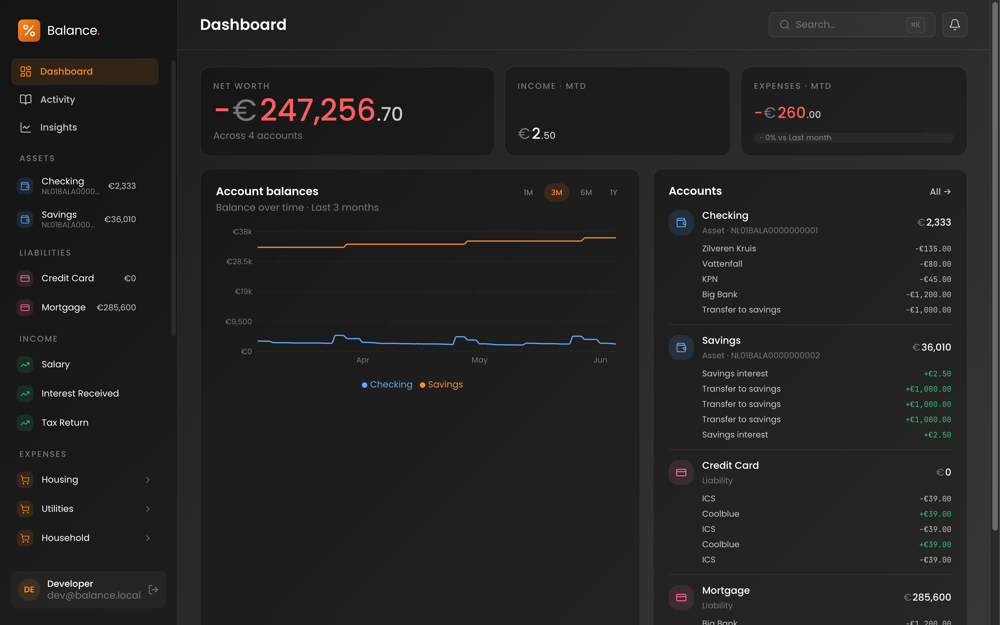
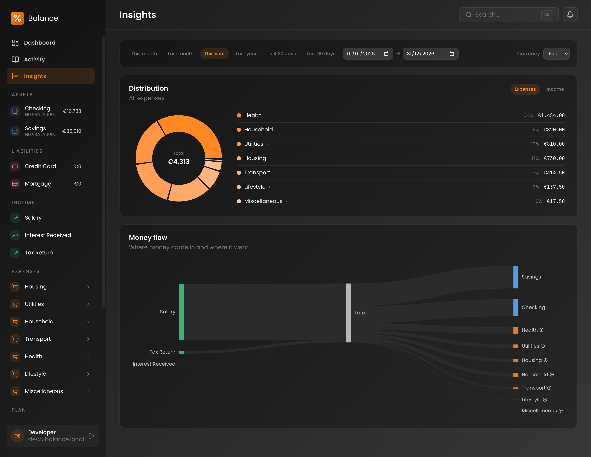

# Balance Budget 

A self-hostable **personal-finance tool backed by a rigorous double-entry ledger**. Instead of envelopes or single-entry categories, every event is a balanced journal entry — so transfers, refunds, splits, and reporting all fall out of one consistent, auditable shape. Import your bank statements, categorize them from an inbox, and read your money back through net-worth and money-flow reports.

> **Status:** a personal project, shared as open source. It is feature-complete enough to use, but it is built for its author's needs — not a polished product. See [Contributing](#contributing) before opening a PR.




## Features

- **Double-entry ledger.** Accounts (Asset / Liability / Equity / Income / Expense), journal entries whose lines net to zero, money stored as exact integer minor units.
- **Nested chart of accounts.** A self-referential account tree with roll-up placeholder parents and postable leaves.
- **Bank-statement import.** Bank-agnostic, deduplicated, immutable `BankTransaction` records; ING CSV and PDF importers (current, savings, and credit-card layouts) out of the box. New banks are new integration projects.
- **Categorization inbox.** Work imported rows into journal entries one at a time or in bulk, with self-transfer detection, attach/detach to existing entries, and a manual picker.
- **Insights.** Distribution and a signed money-flow (Sankey) report over a chosen period.
- **Search.** A ⌘K launcher plus per-list filters.
- **Multi-user shared ledger.** Cookie auth for the SPA, opaque personal access tokens for third-party clients; every user shares one household ledger.
- **Runs on SQLite or PostgreSQL**, picked at runtime.

## Tech stack

- **Backend:** ASP.NET Core Minimal APIs on **.NET 10**, EF Core, a three-layer onion architecture, Quartz jobs, OpenAPI/Scalar.
- **Frontend:** **React 19** + TypeScript + Vite, Tailwind v4, TanStack Router + Query, Recharts. Wire types are generated from the OpenAPI document at build time.
- **Database:** SQLite (default) or PostgreSQL, with provider-specific migrations.

See [`docs/architecture.md`](docs/architecture.md) for the project graph and [`docs/adr/`](docs/adr/) for the decisions behind the design.

## Getting started

```bash
dotnet tool restore
dotnet restore
npm install            # installs the SPA workspace (src/Balance.Web.Client) into the root node_modules
dotnet build

# Run (two terminals)
dotnet run --project src/Balance.Web/Balance.Web.csproj # .NET host on :5248
npm run dev                                             # Vite dev server on :5173 — browse this
```

Run in the **Development** environment to get a wipe-and-rebuilt sample ledger to click around in. Full setup, configuration, and database notes are in [`docs/getting-started.md`](docs/getting-started.md).

### Self-hosting

The SPA is bundled into the ASP.NET publish output, so the whole app ships as a single container. A `Dockerfile` lives at [`src/Balance.Web/Dockerfile`](src/Balance.Web/Dockerfile); the default SQLite database is written to `/data/balance.db` inside the container (mount a volume to persist it). Put it behind a reverse proxy that terminates TLS — the app trusts forwarded headers.

## Built with AI

Balance Budget is developed with heavy use of AI coding agents. The repository guide for agents (and humans) is [`CLAUDE.md`](CLAUDE.md), the domain glossary is [`CONTEXT.md`](CONTEXT.md), and the agent-orchestration harness used to build it lives in [`.sandcastle/`](.sandcastle/). Much of the codebase and its history reflect that workflow, and that's by design.

## Contributing

**This project does not accept bug reports or feature requests** — GitHub Issues are disabled. **Only pull requests containing code are welcome**, and all contributors must sign the [Contributor License Agreement](CLA.md) (handled automatically by a bot on your first PR). Please read [`CONTRIBUTING.md`](CONTRIBUTING.md) first; it covers the CLA, the [Conventional Commits](https://www.conventionalcommits.org/) convention, and the build/test workflow.

## License

[GNU AGPL-3.0](LICENSE). If you run a modified version as a network service, you must make your source available to its users. © 2026 Christiaan de Ridder.
