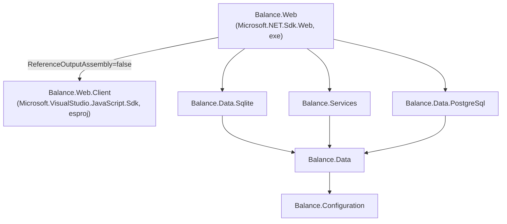

# Architecture

Balance Budget is a three-layer onion ASP.NET Core 10 application (Web → Services → Data) with a React + Vite single-page app shipped inside the same publish output. This document describes the skeleton that domain code plugs into.

## Solution

The solution file is `Balance.slnx` (the modern XML solution format — not `.sln`).

```
Balance.slnx
├── /solution/          Build & repo-level files (.editorconfig, props, README, …)
├── /src/
│   ├── Balance.Configuration
│   ├── Balance.Data
│   ├── Balance.Data.PostgreSql
│   ├── Balance.Data.Sqlite
│   ├── Balance.Services
│   ├── Balance.Web
│   └── Balance.Web.Client
└── /tests/
    └── Balance.Tests
```

## Project graph



Notes:
- `Balance.Data` does **not** reference the provider-specific projects. It targets EF Core's relational abstractions and lets the host process load the right migrations assembly at runtime.
- `Balance.Web` references both provider-specific projects directly so their migration assemblies are loaded.
- `Balance.Web` references `Balance.Web.Client` with `ReferenceOutputAssembly="false"` — the esproj produces no .NET assembly; the project reference exists purely so MSBuild builds the SPA (`npm run build` → `dist/`) and packs its static assets into the ASP.NET publish output.
- `Balance.Tests` references `Balance.Web` and `Balance.Services` (transitively pulling in the rest). Both expose internals via `InternalsVisibleTo("Balance.Tests")`.

## Layers

### Balance.Configuration

- `IOptionsSection` — a static-abstract contract requiring `static string Section`. All options classes implement it so the binding helper can locate their config section by type.
- `Options/DatabaseOptions` — `Provider` (`Sqlite` | `Postgres`) and `ConnectionString`.
- `Helpers/HostEnvironmentExtensions` — `IsContainer()` and `IsContainerFastMode()` based on the `DOTNET_RUNNING_IN_CONTAINER` / `…_FAST_MODE` env vars.
- `Helpers/ConfigurationExtensions` — `GetSection<T>()` and `GetSectionOrDefault<T>()` typed lookups.
- `ServiceCollectionExtensions.AddBalanceConfiguration` registers all known options sections (currently just `DatabaseOptions`).

### Balance.Data

- `BalanceDbContext` (in `SpottarrDbContext.cs` — see [Known oddities](#known-oddities)) — implements `IDataProtectionKeyContext` so ASP.NET Data Protection keys persist to the same database. Exposes `Provider` so consumers can branch on dialect when necessary. Enables `EnableDetailedErrors` / `EnableSensitiveDataLogging` in development only.
- `Entities/BaseEntity` — `Id` (`int`), `CreatedAt` (`init`), `UpdatedAt`. All domain entities should derive from this.
- `Helpers/DbContextOptionsBuilderExtensions.UseProvider` — the provider switch. Returns a `UseSqlite(...).UseBulkInsertSqlite()` or `UseNpgsql(...).UseBulkInsertPostgreSql()` builder, wiring the appropriate migrations assembly.
- `Helpers/DbPathHelper` — picks the SQLite file path (`/data/balance.db` in containers, `%LOCALAPPDATA%/balance-budget/balance.db` otherwise) and proactively probes for write access.
- `Helpers/DateConverters` — `UtcConverter` and `UtcNullableConverter` ensure `DateTime` columns round-trip with `Kind = Utc`.
- `Helpers/HostExtensions.MigrateDatabase` — applies pending migrations at host startup and logs through the source-generated logger.
- `Helpers/DatabaseFacadeExtensions` — `Vacuum()` and `Analyze()` raw-SQL helpers.
- `Logging/LoggerExtensions` — partial class for source-generated `[LoggerMessage]` methods.
- `ServiceCollectionExtensions.AddBalanceData` registers `BalanceDbContext` (and its factory) plus ASP.NET Data Protection persisted to the same context with application name `"Balance"`.

### Balance.Data.Sqlite / Balance.Data.PostgreSql

Empty class libraries that exist solely to host provider-specific EF Core migrations. They reference `Balance.Data` plus the relevant EF Core provider package. The runtime selects the matching assembly via `MigrationsAssembly("Balance.Data.Sqlite" | "Balance.Data.PostgreSql")`.

### Balance.Services

- `ApplicationVersionService` / `IApplicationVersionService` — reads `AssemblyInformationalVersionAttribute` from the entry assembly; falls back to `"0.0.0"`.
- `Jobs/JobsServiceCollectionExtensions.AddBalanceJobs` — registers Quartz with `SchedulerName = "Balance Scheduler"` and the hosted service that waits for application startup and job completion on shutdown.
- `Jobs/ServiceCollectionQuartzConfiguratorExtensions.ScheduleJob<TJob>` — schedules a job with a cron expression, optional immediate start, and `DisallowConcurrentExecution`.
- `Jobs/TriggerConfiguratorExtensions.StartNow(bool)` — conditional variant of Quartz's `StartNow()`.
- `Logging/LoggerExtensions` — partial class for source-generated `[LoggerMessage]` methods.
- `ServiceCollectionExtensions.AddBalanceServices` composes `Configuration` + `Data` + `Jobs` and registers `IApplicationVersionService`. The `startJobs` parameter (default `true`) flips whether jobs trigger immediately — the Console host passes `false`.

### Balance.Web

Built with `WebApplication.CreateSlimBuilder` for fast startup and minimal default services. Uses workstation GC (`<ServerGarbageCollection>false</ServerGarbageCollection>`) because the app is expected to run in resource-constrained containers. Hosts both the JSON API and the React SPA shell.

- `Program.cs` — startup order: configure logging → remap config sources → compose services → build → migrate the database → map the SPA (`MapStaticAssets()` + `MapFallbackToFile("index.html")`) → map all backend routes under `var api = app.MapGroup("/api")` (`/api/healthz/{live,ready}`, `/api/openapi/{document}.json`, `/api/docs/` for Scalar, and the feature endpoint groups) → middleware pipeline.
- `Configuration/ConfigurationManagerExtensions.MapConfigurationSources` — in development and container-fast-mode, points JSON config providers at `AppContext.BaseDirectory` so the solution-root `appsettings.json` is found when running from source.
- `Logging/LoggingBuilderExtensions.AddConsole` — single-line console logger with timestamps in containers, default console logger otherwise.
- `ServiceCollectionExtensions.AddBalanceWeb` — OpenAPI, lowercase route options, forwarded-headers (proxy IP whitelist cleared — the app trusts any proxy by assumption that it never sits on the public internet directly), cookie authentication, authorization, antiforgery, permissive default CORS policy, health checks.
- The SPA shell is served at `/` and any non-`/api` URL via `MapFallbackToFile("index.html")`; the SPA's built assets come from the `Balance.Web.Client` esproj reference and are picked up by `MapStaticAssets()` (ASP.NET Core 9+ static-web-assets pipeline).

### Balance.Web.Client

React 19 + TypeScript + Vite 8 SPA. The `.esproj` (`Microsoft.VisualStudio.JavaScript.Sdk/1.0.5550578`) wraps `npm run build` and emits to `dist/`. The project is referenced from `Balance.Web` with `ReferenceOutputAssembly="false"` so MSBuild builds the SPA whenever `Balance.Web` builds, and the resulting static assets are packed into the publish output. During development, `npm run dev` runs the Vite dev server (default `http://localhost:5173`) with HMR; `vite.config.ts` proxies `/api` to the .NET host at `http://localhost:5248`, so the browser only ever talks to one origin and CORS stays out of the picture.

### Balance.Tests

TUnit-based test suite. `Microsoft.Testing.Platform` is the configured test runner (`global.json` → `"test": { "runner": "Microsoft.Testing.Platform" }`). CI emits cobertura coverage and a GitHub-flavoured Markdown summary that is posted back to the PR.

## Startup composition

The web host follows this shape:

```
builder.Logging.AddConsole(...)
builder.Configuration.MapConfigurationSources(...)
builder.Services.AddBalanceServices(builder.Configuration)
builder.Services.AddBalanceWeb()
var app = builder.Build();
await app.MigrateDatabase(lifetime.ApplicationStopping);

// SPA shell — everything not under /api falls back here
app.MapStaticAssets();
app.MapFallbackToFile("index.html");

// API surface — all backend routes live under /api
var api = app.MapGroup("/api");
api.MapHealthChecks("/healthz/live",  ...);
api.MapHealthChecks("/healthz/ready", ...);
api.MapOpenApi();
api.MapScalarApiReference("/docs", o => o.WithOpenApiRoutePattern("/api/openapi/{documentName}.json"));
api.MapCurrencies(); api.MapAccounts(); api.MapCounterparties();
api.MapBankAccounts(); api.MapBankTransactions(); api.MapJournalEntries();

// Middleware pipeline
await app.RunAsync(lifetime.ApplicationStopping);
```

Middleware order in `Program.cs`:

```
ExceptionHandler → StatusCodePages → ForwardedHeaders → DefaultFiles → Routing → CORS → Authentication → Authorization → Antiforgery
```

## Build and CI

- `Directory.Build.props` (applies to every project):
  - `TargetFramework=net10.0`
  - `TreatWarningsAsErrors=true`
  - `Nullable=enable`, `ImplicitUsings=enable`
  - `EnableNETAnalyzers=true`, `AnalysisMode=All`, `AnalysisLevel=latest`
  - `LangVersion=latest`
  - `UseArtifactsOutput=true` — all build output goes under `/artifacts/`, gitignored.
- `Directory.Packages.props` — centralised package versions (`ManagePackageVersionsCentrally=true`).
- `global.json` — pins SDK `10.0.300` with `rollForward=latestMinor`, registers `Microsoft.Testing.Platform` as the test runner.
- `dotnet-tools.json` — CSharpier `1.2.6` as the project-local formatter.
- `.editorconfig` — minimal; disables `CA2007` (no `ConfigureAwait` on tasks in app code).
- CI (`.github/workflows/build-and-test.yml`):
  1. `dotnet tool restore`
  2. `dotnet restore`
  3. `dotnet csharpier check .`
  4. `dotnet build --no-restore`
  5. CodeQL analyze (public repos only)
  6. `dotnet test` with cobertura coverage
  7. Sticky PR comments for test results and coverage
- A separate `codeql.yml` re-runs CodeQL on a weekly cron.

## Known oddities

- `src/Balance.Data/SpottarrDbContext.cs` contains the class `BalanceDbContext`. The filename is a leftover from a fork from the [Spottarr](https://github.com/christiaanderidder/spottarr) project; the class name is canonical. Treat the class name as authoritative.
